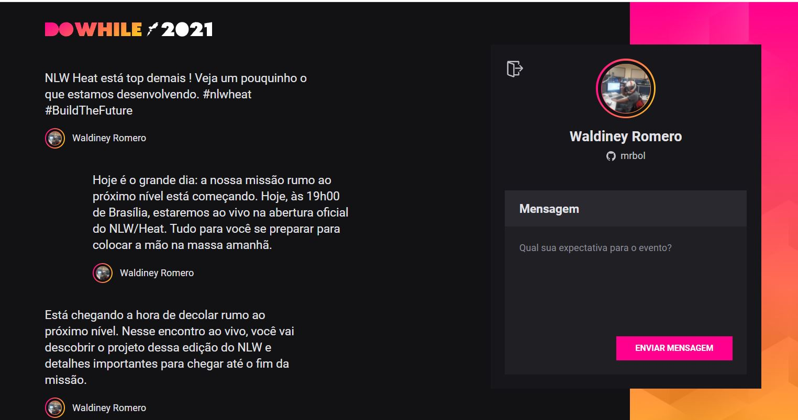

# NLW Heat 

Durante essa semana participei da NLW Heat, evento promovido pela Rocketseat. Nessa edição foi desenvolvido um projeto que permite com que as pessoas se conectem a plataforma através da sua conta no GitHub e que, quando conectadas, possam compartilhar suas expectativas sobre o DoWhile.

## 🚀 Stage 01
back-end foi desenvolvido com as seguintes tecnologias:
- TypeScript
- Express
- Prisma
- JSON Web Token
- Socket.IO

Obs.: Nesse projeto temos autenticação via OAuth com o GitHub

### Como executar
- Clone o repositório e acesse a pasta;
- Faça uma copia do arquivo .env.example para .env e preencha com as suas credenciais do GitHub;
- Instale as dependências com yarn;
- Executa as migrations com yarn prisma migrate dev;
- Inicie o servidor com yarn dev;
- A aplicação pode ser acessada em localhost:4000.

## 🚀🚀 Stage 02
Front-end web desenvolvido com as seguintes tecnologias:
- TypeScript
- Vite 
- React
- Expo
- Socket.Io 

### Como executar
- Clone o repositório e acesse a pasta;
- Faça uma copia do arquivo .env.example para .env e preencha com as suas credenciais do GitHub;
- Instale as dependências com yarn;
- Inicie o servidor com yarn dev;

## 🚀🚀🚀 Stage 03
Front-end mobile desenvolvido com as seguintes tecnologias:
-  React Native
- Typescript
- Expo
- Context API
-  Axios
- Socket.Io 

### Como executar
- Clone o repositório e acesse a pasta;
- Faça uma copia do arquivo .env.example para .env e preencha com as suas credenciais do GitHub;
- Instale as dependências com yarn

Utilize o **yarn** ou o **npm install** para instalar as dependências do projeto.
Em seguida, inicie o projeto.

```cl
expo start
```


